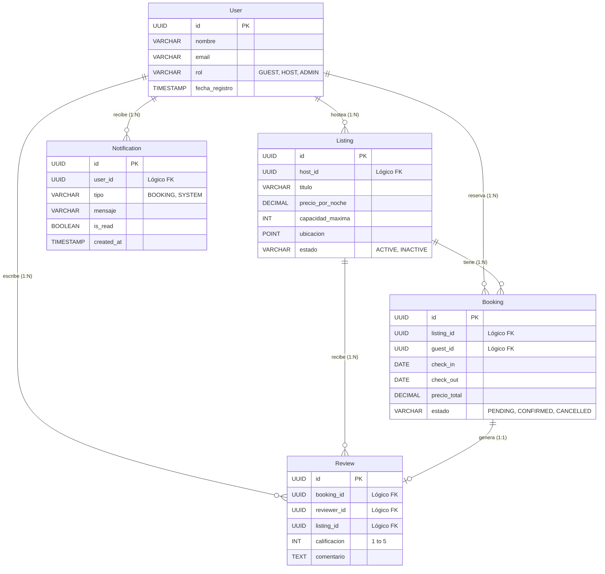
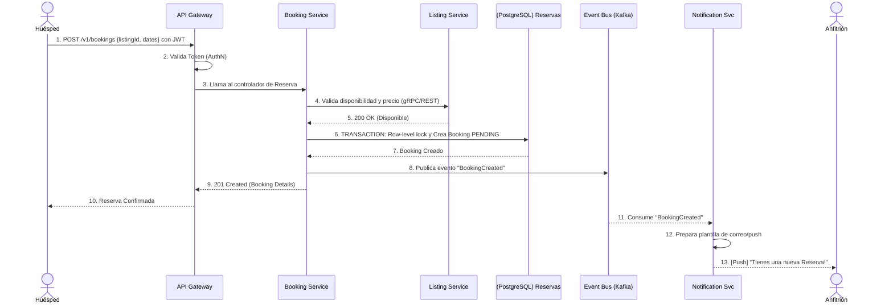
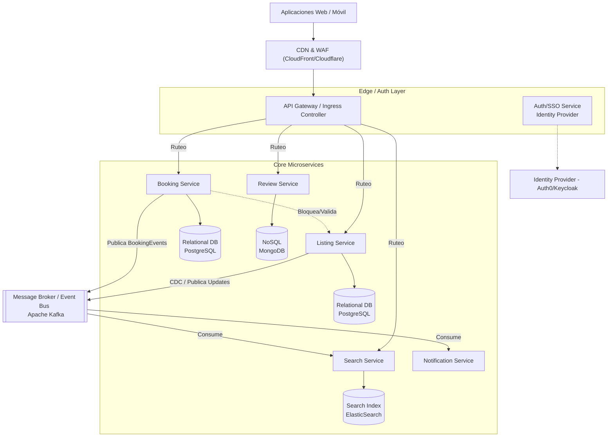
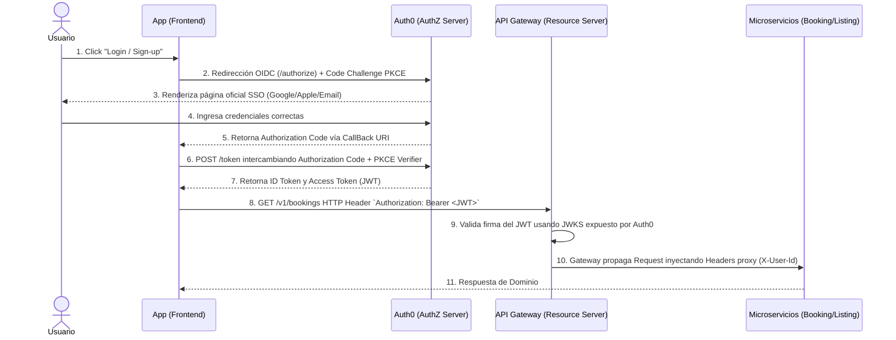

# Airbnb - Documento de Diseño Técnico

## Parte 1: Diseño de Sistema + AuthZ/AuthN + Smithy

- **Curso:** Diseño e Implementación de Sistemas
- **Entregable:** Parte 1 de 3
- **Equipo:**
  - Llusco Blanco Fernando Rene
  - Rios Nuñez David Samuel
  - Rivera Quisberth David Hugo
  - Terceros Beltrán Oscar Alvaro
  - Torrez Azuga Marcelo

- **Sistema Elegido:** Airbnb
- **Fecha de Entrega:** [Por confirmar]
- **Evaluador:** [Por confirmar]

---

## Entregables Requeridos

> Marque cada ítem como recibido antes de comenzar la evaluación.

- [ ✅ ] Documento de diseño técnico (usando la plantilla del curso, estado:
  **EN REVISIÓN** o **REVISADO**)
- [ ✅ ] Definiciones de modelo Smithy (`.smithy`) con al menos una operación
  por recurso principal
- [ ✅ ] Proyecto Smithy que genera código (build funciona sin errores)
- [ ✅ ] Diagrama de flujo de autenticación (AuthN) con OIDC/SSO
- [ ✅ ] Diagrama de modelo de autorización (AuthZ) con roles y scopes
- [ ✅ ] Repositorio o carpeta entregada con historial de contribuciones visible

**ESTADO DEL DOCUMENTO:** EN REVISIÓN

---

## Resumen

Este documento describe el diseño técnico de alto nivel del sistema de backend
para Airbnb, una plataforma global que conecta a anfitriones que ofrecen
alojamiento temporal con huéspedes que buscan estancias. El sistema permite
gestionar los inventarios (alojamientos) a gran escala, realizar búsquedas
rápidas mediante filtros precisos, administrar el flujo transaccional seguro de
pagos/reservas y gestionar un modelo de reputación a través de reseñas.

## Supuestos

Durante el diseño de esta arquitectura se asumen como verdaderas las siguientes
condiciones previas fundamentales:

1. **Gestión de Identidad Externa:** Se dispone de un proveedor de identidad de
   grado empresarial (Auth0) con alta disponibilidad para orquestar la
   autenticación unificada (SSO), relevando a nuestro sistema del almacenamiento
   crítico de contraseñas.
2. **Pasarela de Pagos (PCI-DSS):** La tokenización de tarjetas y el
   procesamiento directo a redes bancarias recaen íntegramente en un proveedor
   externo seguro (Stripe), asumiendo que interactuaremos con ellos mediante
   abstracciones de API.
3. **Infraestructura Cloud-Native:** El sistema se desplegará sobre una nube
   pública moderna (AWS) que provee aprovisionamiento elástico para
   contenedores, bases de datos gestionadas y colas de mensajería (Kafka).
4. **Red de Distribución de Multimedia (CDN):** El gran peso del contenido
   estático (fotografías en alta resolución de los alojamientos) será absorbido
   por una Red de Distribución de Contenido global, por ende, asumiendo que no
   consumirá el ancho de banda del backend de las Core APIs.

## Alcance y Fases

La presente **Fase 1** cubrirá el diseño base del núcleo transaccional y de
publicación o lectura prioritaria a los usuarios. Los componentes incluidos en
el alcance son:

- Motor de listado y búsqueda de propiedades.
- Flujo de transacciones y cálculo de la reserva.
- Flujo estándar de reviews (reseñas) para garantizar la confianza entre
  usuarios.

**Fuera del alcance:**

- Sistemas de Data Warehouse / Inteligencia Artificial para recomendaciones
  súper avanzadas.
- Soporte al cliente e integración con pasarelas de pago a muy bajo nivel
  (asumiremos una abstracción vía API a Stripe/PayPal).

---

## 1. Requerimientos

### 1.1 Requerimientos Funcionales

1. **Búsqueda y Reserva de Alojamiento (Huéspedes):** Los huéspedes deben poder
   buscar alojamientos especificando su ubicación deseada, fechas y número de
   personas en la aplicación, para obtener una lista de opciones disponibles con
   su precio exacto, y poder confirmar la reserva del alojamiento seleccionado
   con el fin de asegurar su estancia temporal de manera rápida y segura.
2. **Publicación y Gestión de Alojamientos (Anfitriones):** Los anfitriones
   deben poder publicar sus propiedades especificando fotos, descripción, precio
   y ubicación en la plataforma, para ofrecer su alojamiento en el catálogo de
   búsqueda de los huéspedes, y poder gestionar la disponibilidad de su
   calendario con el fin de monetizar su espacio de forma confiable e
   ininterrumpida.
3. **Calificación y Feedback Pos-estancia (Usuarios):** Los usuarios (huéspedes
   y anfitriones) deben poder redactar una reseña especificando una calificación
   de 1 a 5 estrellas y un comentario de texto en la plataforma, para documentar
   públicamente cómo fue la estadía, y poder publicar sus métricas en sus
   respectivos perfiles con el fin de construir una sólida reputación que
   fomente transacciones seguras en toda la comunidad.

### 1.2 Requerimientos No Funcionales

1. **Disponibilidad y Tolerancia a Fallos (CAP):** El sistema de catálogo y
   motor de búsqueda (search core) debe priorizar la Disponibilidad sobre la
   Consistencia fuerte (asegurando un sistema tipo AP), garantizando operaciones
   con un uptime de al menos **99%** para que los usuarios puedan explorar
   alojamientos y descubrir opciones constantemente sin interrupciones
   operativas.
2. **Consistencia Transaccional (Bases de Datos):** El servicio de pagos y
   finalización de reservas (booking engine) debe priorizar la Consistencia
   estricta y cumplir con el estándar ACID (asegurando un sistema tipo CP),
   garantizando bloqueo a nivel de fila y aislamiento de datos para que el
   sistema prevenga por completo las colisiones de "double-booking" o
   sobreventas en una misma fecha.
3. **Latencia y Performance (Búsquedas):** La estructura principal de entrega de
   resultados y búsqueda geoespacial debe utilizar memorias caché distribuidas
   (ej. Redis) y CDNs, garantizando respuestas con una latencia `p95` inferior a
   **500 ms** para que los huéspedes experimenten una navegación fluida e
   instantánea sin importar su continente.
4. **Escalabilidad (Ratio Lectura/Escritura 100:1):** Las instancias de
   microservicios de lectura en catálogo deben balancearse dinámicamente,
   garantizando capacidad elástica para manejar un pico de al menos **~3,500 QPS
   de lectura** y **5 Millones de DAU** (Daily Active Users) para que la
   plataforma no colapse durante la temporada de alta demanda vacacional.
5. **Seguridad y Control de Acceso:** El sistema central de APIs y transacciones
   debe encriptar toda comunicación en tránsito (TLS) y validar cada petición
   mediante tokens de identidad seguros (OIDC/JWT), garantizando que el **100%
   de los accesos a datos financieros y privados** estén estrictamente
   autenticados y autorizados para que la plataforma proteja la integridad de
   los usuarios contra fraudes y cumpla con los estándares de la industria.

### 1.3 Estimación de Capacidad

- **Tráfico Estimado Diario (DAU):** 5,000,000 de usuarios activos diarios.
- **Tráfico de Lectura (Read QPS):** Asumiendo ~20 acciones de
  búsqueda/visualización por usuario al día → 100M diarias → **~1,150 QPS
  (promedio)** con picos estacionales de **~3,500 QPS**.
- **Tráfico de Escritura (Write QPS):** Extrayendo un escenario con aprox 5% de
  conversión (250,000 reservas/día) con eventos adicionales (actualizaciones de
  precios) → **~6 a 10 QPS (promedio)**.
- **Almacenamiento de Red (CDN / Imágenes):** Si el catálogo tiene 5 Millones de
  listados subidos de alta definición con un tamaño representativo de 20MB en
  multimedia. Requeriremos un total de al menos 100 Terabytes (TB) en Object
  Storage global altamente disponible y replicado en cachés de última milla.

---

## 2. Entidades Principales y Modelo de Datos

Las siguientes entidades lógicas constituyen el núcleo de los recursos que la
plataforma manejará. Bajo una arquitectura de **Microservicios**, cada entidad
principal será gobernada por su propio servicio y residirá en su propia base de
datos dedicada (patrón _Database-per-Microservice_) para garantizar un
acoplamiento débil, resiliencia y escalado independiente.

### 2.1 Diccionario de Entidades y Bases de Datos

1. **User (Usuario):** Representa la identidad fundamental dentro de la
   plataforma. Un mismo usuario puede adoptar roles dinámicos (Huésped o
   Anfitrión) según la transacción.
   - **Campos clave:** `id` (UUID), `email` (String), `passwordHash` (String),
     `role` (Enum), `createdAt` (Timestamp).
   - **Almacenamiento:** Base de datos relacional (ej. PostgreSQL) del _User
     Service_.
2. **Listing (Alojamiento):** Representa el inventario ofertado por los
   anfitriones.
   - **Campos clave:** `id` (UUID), `hostId` (UUID, Ref Lógica: User), `title`
     (String), `pricePerNight` (Decimal), `maxGuests` (Integer), `location`
     (Point/Lat&Lon), `status` (Enum).
   - **Almacenamiento:** PostgreSQL como fuente de verdad del _Listing Service_,
     sincronizado asíncronamente hacia ElasticSearch/Redis (_Search Service_)
     para búsquedas geoespaciales y ultrarrápidas.
3. **Booking (Reserva):** La entidad transaccional que entrelaza Huésped,
   Anfitrión, Alojamiento y un rango de fechas.
   - **Campos clave:** `id` (UUID), `listingId` (UUID, Ref Lógica: Listing),
     `guestId` (UUID, Ref Lógica: User), `checkIn` (Date), `checkOut` (Date),
     `totalPrice` (Decimal), `status` (Enum).
   - **Almacenamiento:** Base de datos relacional estricta (ej. PostgreSQL) del
     _Booking Service_ para garantizar bloqueos por fila (ACID) y prevensión
     total del _double-booking_.
4. **Review (Reseña):** La prueba de la estancia y el sustento de la confianza
   de la comunidad.
   - **Campos clave:** `id` (UUID), `bookingId` (UUID, Ref Lógica: Booking),
     `reviewerId` (UUID, Ref Lógica: User), `listingId` (UUID, Ref Lógica:
     Listing), `rating` (Integer: 1-5), `comment` (String).
   - **Almacenamiento:** Base de datos NoSQL documental (ej. MongoDB) o
     PostgreSQL del _Review Service_.
5. **Notification (Notificación):** Alertas asíncronas enviadas a los usuarios
   (ej. confirmación de pago, nueva reserva para el anfitrión, alerta de
   check-in).
   - **Campos clave:** `id` (UUID), `userId` (UUID, Ref Lógica: User), `type`
     (Enum: BOOKING_CREATED, REVIEW_REMINDER, SYSTEM_ALERT), `message` (String),
     `isRead` (Boolean), `createdAt` (Timestamp).
   - **Almacenamiento:** Base de datos optimizada para rápida escritura/lectura
     y TTLs (ej. MongoDB, Redis o Cassandra) del _Notification Service_.

### 2.2 Relaciones Lógicas y Esquema (ER)

En un entorno nativo de microservicios, no existen las Foreign Keys (FK)
tradicionales que crucen las fronteras de las bases de datos. Las relaciones
representadas a continuación indican **referencias lógicas** a través de UUIDs.
La consistencia eventual u orquestación de datos entre ellos recae en esquemas
de Eventos (Event-Driven) o sagas.

---

## 3. Interfaz del Sistema (API REST)

Para cumplir con los requerimientos funcionales, diseñaremos una **API RESTful**
gobernada por una especificación centralizada basada en **AWS Smithy** (_API
First approach_). La API estará correctamente versionada bajo el segmento `/v1/`
y orientada a recursos (sustantivos en plural).

Por razones estrictas de seguridad, **nunca confiaremos en enviar perfiles de
usuario sensibles desde el cliente**. Todas las llamadas (excepto las públicas
como la búsqueda) requerirán autenticación de estado mediante un token JWT
enviado por cabecera, aplicando el trait de Smithy `@httpBearerAuth`. El backend
deducirá del token validado si el autor es el `guestId` (Huésped) o `hostId`
(Anfitrión), bloqueando inyecciones.

### 3.1 Diseño de Recursos y Endpoints

A continuación, se define el contrato preliminar para las operaciones
principales ligadas a nuestras entidades:

#### Alojamiento (Listing Service)

- **`GET /v1/listings`**
  - **Uso:** Búsqueda pública del catálogo para los Huéspedes.
  - **Auth:** Público (No `@httpBearerAuth`).
  - **Inputs:** Parámetros _opcionales_ en _Query String_ (`lat`, `lon`,
    `checkIn`, `checkOut`, `minPrice`, `maxPrice` -> validados con `@range` y
    `@pattern`).
  - **Outputs:** Lista mapeada de estructuras `ListingSummary`.
  - **Errores:** `400 BadRequest` (Filtros estropeados).
- **`POST /v1/listings`**
  - **Uso:** Creación de una nueva propiedad ofertada (Anfitriones).
  - **Auth:** Requerido (El `hostId` es autoderivado del JWT).
  - **Inputs:** JSON Body exigiendo `@required` en `title` (validado con
    `@length`), `pricePerNight`, `maxGuests` y `location`.
  - **Outputs:** Código `201 Created` retornando el `Listing` completo.
  - **Errores:** `400 BadRequest`, `401 Unauthorized`.

#### Reserva (Booking Service)

- **`POST /v1/bookings`**
  - **Uso:** Creación transaccional de una reserva sobre un listing.
  - **Auth:** Requerido (El `guestId` se infiere del JWT).
  - **Inputs:** JSON Body con `listingId`, `checkIn` y `checkOut`.
  - **Outputs:** Código `201 Created` detallando el `Booking` (estado PENDING o
    CONFIRMED).
  - **Errores:** `409 Conflict` (Fechas ya ocupadas - DobleBooking mitigado),
    `400 BadRequest` (Fechas retrógradas), `404 NotFound` (Listing inexistente).
- **`GET /v1/bookings/{bookingId}`**
  - **Uso:** Consultar los pormenores de una reserva para un itinerario.
  - **Inputs:** Parámetro anclado en _Path_ `{bookingId}`.
  - **Outputs:** Código `200 OK` con modelo expandido `BookingDetail`.
  - **Errores:** `403 Forbidden` (El JWT revela que el usuario no es ni el
    huésped de la reserva ni el dueño del listing), `404 NotFound`.

#### Reseñas (Review Service)

- **`POST /v1/bookings/{bookingId}/reviews`**
  - **Uso:** (Diseño REST anidado) Dejar una calificación asociada directamente
    al contexto de una reserva y sus usuarios.
  - **Auth:** Requerido (El `reviewerId` viene del JWT).
  - **Inputs:** Parámetro de ruta `{bookingId}` y JSON Body con `rating`
    (restringido por Smithy `@range(min: 1, max: 5)`) y `comment`.
  - **Outputs:** `201 Created` con el recurso de confirmación.
  - **Errores:** `403 Forbidden` (La reserva no existe para ti o no ha
    concluido), `409 Conflict` (Ya redactaste una reseña).

### 3.2 Manejo de Errores en la API

Siguiendo el ecosistema e inyección de **Smithy**, todos los servicios mapearán
y lanzarán estructuras de error globales centralizadas usando `@error("client")`
y `@error("server")` enlazadas a los verbos HTTP correspondientes:

1. **`BadRequestError` (`400`):** La estructura del client rompió reglas
   semánticas Smithy (`@required` omitido, longitud o regex `@pattern` violado).
2. **`UnauthorizedError` (`401`):** Ausencia total del token de portador (JWT),
   o token caducado/manipulado.
3. **`ForbiddenError` (`403`):** El usuario completó AuthN, pero falló en
   **AuthZ** (Sección RBAC). Ej: Intentar borrar un Listing que le pertenece a
   otro usuario.
4. **`NotFoundError` (`404`):** Endpoint, ID o entidad inexistente.
5. **`ConflictError` (`409`):** Reglas de negocio vulneradas. Crítico para
   denegar operaciones financieras simúltaneas.
6. **`InternalServerError` (`500`):** Caída catastrófica del nodo backend, Redis
   down o partición de red que no permite persistir en la DB.

---

## 4. Flujo de Datos

A continuación, se ilustra el flujo transaccional crítico para la **Reserva de
un Alojamiento**, donde múltiples microservicios colaboran para mantener la
consistencia (CP) y notificar al usuario asíncronamente.

---

## 5. Diseño de Alto Nivel

La arquitectura sigue el patrón de microservicios alojados en la nube orientados
a transacciones web a gran escala.

### 5.1 Diagrama de Componentes

### 5.2 Explicación de Componentes y Decisiones de Diseño

1. **CDN y WAF (Web Application Firewall):**
   - Sirve estáticos pesados (miles de fotos HD de los alojamientos)
     perimetralmente para aminorar el tráfico a nuestros servidores, cumpliendo
     la latencia < 500ms.
   - Protege contra inyecciones SQL y ataques de denegación de servicio (DDoS).
2. **API Gateway:**
   - Termina la encriptación TLS proporcionando el límite seguro externo.
   - Se encarga del _Rate Limiting_ para evitar raspados masivos (_scraping_) de
     nuestro inventario y valida el JWT emitido por el Identity Provider antes
     de dejar pasar el tráfico a los microservicios.
3. **CQRS y Catálogo Separado (Search Service vía ElasticSearch):**
   - **Justificación (Tema de Discusión):** Dado que nuestra cuota de lectura vs
     escritura es **100:1**, atacar una tabla PostgreSQL relacional para una
     búsqueda multi-parámetros generaría contención severa.
   - **Solución:** Implementamos segregación de comandos y consultas (CQRS). El
     `Listing Service` escribe a su DB (Postgres). A través de un Bus de Eventos
     o Change Data Capture (CDC), se vuelcan esos datos pre-indexados a un motor
     **ElasticSearch** (Search Service). Esto satisface la parte "Alta
     Disponibilidad (AP)" maximizando la velocidad.
4. **Message Broker (Kafka):**
   - Desacopla lógicamente la arquitectura. Notificaciones y sincronizaciones se
     despachan asíncronamente sin penalizar el flujo principal de los usuarios
     que reservan (evitando timeout bottlenecks).
5. **Booking Service:**
   - Controla las transacciones monetarias y de tiempos. Escribe a una RDBMS
     usando bloqueos a nivel de fila y _Isolation Levels_ elevados
     (Serializability/Read Committed) para proteger el Teorema CP. Garantiza la
     integridad financiera del 100%.
   - **Nota de diseño:** Aunque el cobro final se delegue a una pasarela externa
     (ej. Stripe), estos bloqueos relacionales son obligatorios para prevenir el
     _double-booking_ de fechas y mantener un estado interno consistente ante
     posibles fallas de red asíncronas con el proveedor de pagos.

---

## 6. Seguridad y Control de Acceso (AuthZ/AuthN)

Esta plataforma financiera procesa activos y transacciones de dinero; por lo
cual, aplicamos un perímetro robusto. Delegaremos la gestión identitaria pura a
un **Identity Provider (IdP)** externo certificado (**Auth0**) instaurando una
arquitectura Single Sign-On (SSO).

### 6.1 Flujo de Autenticación (AuthN): OIDC con Authorization Code Flow

Para evitar exponer tokens en las URLs del navegador y resguardarnos ante
aplicaciones móviles maliciosas que suplantan identidad, elegimos el **OIDC
(OpenID Connect) Authorization Code Flow con soporte PKCE** (Proof Key for Code
Exchange).

**Manejo de Tokens emitidos:**

- **ID Token:** Verifica frente al ecosistema del cliente "quién" inició la
  sesión y qué datos mostrar (nombre, perfil, email). No se usa para pedir datos
  a la API.
- **Access Token:** Emitido bajo el formato `JWT` cifrado y procesable.
  Empaqueta atributos como el `sub` (el UUID oficial del usuario), su `exp`
  (expiración corta, usualmente 20 minutos para minimizar riesgos) y los
  `scopes` permitidos.
- **Refresh Token (Estrategia de Renovación):** Para mantener la sesión del
  usuario activa de manera ininterrumpida, el cliente utiliza este token de
  larga duración para solicitar silenciosamente un nuevo _Access Token_ al IdP
  (Auth0) en el _background_ instantes antes de que el actual expire. Para
  prevenir sustracciones, se aplicará "Rotación de Refresh Tokens" (cada uso
  invalida el token anterior y emite uno nuevo).

### 6.2 Modelo de Autorización (AuthZ): RBAC y Verificación

El ecosistema utilizará controles **RBAC (Role-Based Access Control)**
emparejados semánticamente a los escopos (Scopes) de OAuth 2.0 que viajan dentro
del token. El backend extrae el ID del token (`token.sub`) a nivel interceptor y
se niega categóricamente a tragar User IDs duros en los JSON del Body que
permitirían robo de sesión.

| Rol                  | Alcance (OAuth Scopes)                                  | Permisos en la API Smithy                           | Limitaciones / Constraints                                                                                                              |
| -------------------- | ------------------------------------------------------- | --------------------------------------------------- | --------------------------------------------------------------------------------------------------------------------------------------- |
| **Público**          | `read:listings`                                         | `GET /v1/listings`                                  | Solo de lectura general (pre-login). No manda JWT header.                                                                               |
| **GUEST (Huésped)**  | `write:bookings`, `write:reviews`, `read:bookings_self` | `POST /v1/bookings`, `POST /v1/reviews`             | Autorización localiza su token. No puede apartar reservaciones a nombre de terceros (`guestId` siempre será su ID).                     |
| **HOST (Anfitrión)** | `write:listings`, `read:bookings_host`                  | `POST /v1/listings`, `GET /v1/bookings/{bookingId}` | Un anfitrión no puede visualizar ni tocar estancias de una propiedad diferente a la suya (valida que sea dueño del recurso consultado). |
| **ADMIN**            | `all`, `delete:users`                                   | Acceso irrestricto                                  | Segmentado y aislado tras una VPN. No usa el login estándar.                                                                            |

### 6.3 Integración SSO y Gestión de Secretos

El manejo seguro de las credenciales obedece la defensa en profundidad:

1. **Expiración de Tokens y Refresco (TTL):** Los `Access Tokens` emitidos
   viajarán siendo útiles solo por **15 minutos** para acortar ventanas de robo.
   El cliente web guardará un **Refresh Token** (vida de 30 días, rotación
   estricta y de uso único) persistido en una `HttpOnly Cookie`, bloqueando con
   garantías su exposición a fugas XSS o robo mediante javascript.
2. **Derivación Pura y Eliminación del Objeto Body:** La API
   Gateway/Microservicios deduce al cliente por el Bearer Token. El JSON body
   `{ "listingId": "ABC", "dates": "..." }` carece adrede del campo id del
   cliente para erradicar _Horizontal Privilege Escalation_ (IDOR).
3. **Manejo Blindado de Secretos:** Absolutamente ningún API Key de Stripe, Base
   de Datos o llave simétrica de JWT existirá en formato texto plano (Hard
   Coded) ni en `.env` locales que terminen en código fuente. La infraestructura
   de lanzamiento proveerá credenciales en runtime mediante servicios estáticos
   efímeros como **AWS Secrets Manager**, inyectadas on-the-fly al levantar los
   _containers_ de Docker.

---

## 7 Definición de la Interfaz a través de "AWS Smithy"

Como anexo verificable a este documento, se ha desarrollado todo el marco de la
**API REST** utilizando la especificación de **AWS Smithy**
(`airbnb-smithy/model/main.smithy`).

Las integraciones y validaciones dentro del modelo abarcan:

1. Validaciones preventivas (`@length`, `@range`, `@pattern`) en los Cuerpos
   JSON (Ej: Forzando en la reserva que la fecha de checkIn cumpla una Regex
   `YYYY-MM-DD`).
2. Integración de la macro y _Trait_ `@httpBearerAuth` permitida a nivel global
   pero sobre-escrita bajo `@auth([])` exclusivamente en las consultas de
   lecturas públicas (`ListListings`).
3. Estructura de errores centralizada (Ej. `ConflictError 409` mapeando las
   transacciones fallidas de base de datos) permitiendo auto-generación limpia
   de SDks y Swagger OpenApi (vía `smithy-build.json`).
