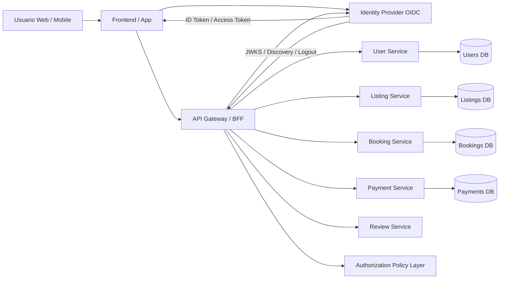

# Airbnb clon – AuthN/AuthZ OIDC SSO

## 1) Objetivo del módulo

Implementar un sistema de **autenticación centralizada** y **autorización distribuida** para el clon de Airbnb, permitiendo inicio de sesión único con **OIDC/SSO**, soporte para web y móvil, y control de permisos por rol y por recurso dentro de una arquitectura de microservicios.

OIDC es una capa de identidad construida sobre OAuth 2.0; además define `ID Token`, `UserInfo`, `scopes` y `claims` estándar para identidad interoperable.

---

## 2) Qué resuelve cada parte

**AuthN (Authentication)** verifica quién es el usuario: huésped, anfitrión o administrador.  
**AuthZ (Authorization)** decide qué puede hacer: crear anuncios, reservar, cancelar, administrar usuarios, moderar contenido, etc.

Para este proyecto, conviene que **OIDC/SSO resuelva la identidad** y que los microservicios apliquen **reglas de autorización** sobre roles y ownership del recurso. Esa separación está alineada con el modelo de OIDC/OAuth, donde el proveedor de identidad autentica al usuario y emite tokens/claims consumidos por los clientes y APIs.

---

## 3) Arquitectura propuesta

La idea es usar un **Identity Provider (IdP)** compatible con OIDC como pieza central. El frontend obtiene autenticación mediante OIDC, mientras que el **API Gateway** o **BFF** valida tokens y distribuye la identidad a los microservicios.

OIDC Discovery permite descubrir de forma estándar endpoints como authorization, token, jwks y userinfo, lo que simplifica la integración.

---

## 4) Componentes del módulo

### 4.1 Identity Provider OIDC
Responsable de login, registro, MFA, federación social y SSO. También emite `ID Token`, `Access Token` y, según el caso, `Refresh Token`.

El `ID Token` representa el resultado de la autenticación e incluye al menos un identificador del usuario (`sub`) y metadatos de autenticación. 

### 4.2 Frontend Web / Mobile
Redirige al IdP para autenticación y consume la sesión resultante.

Para apps browser-based, la práctica recomendada es **Authorization Code Flow + PKCE**; para apps nativas, las solicitudes OAuth deberían hacerse a través del navegador externo del usuario.

### 4.3 API Gateway o BFF
Valida el token, extrae claims relevantes y reenvía el contexto de identidad a los microservicios.

Si usas tokens opacos, el gateway puede consultar el estado del token mediante **token introspection**.

### 4.4 Authorization Policy Layer
Aplica reglas de negocio como:
- un **guest** puede reservar y dejar reseñas;
- un **host** puede crear y administrar solo sus propiedades;
- un **admin** puede moderar listados, usuarios y reportes.

Esto ya no depende de OIDC en sí, sino de tu diseño de permisos sobre los claims y los recursos de negocio.

---

## 5) Roles propuestos para el clon de Airbnb

Se recomienda comenzar con estos roles:

- **guest**: buscar alojamientos, reservar, pagar, cancelar bajo políticas, dejar reseñas.
- **host**: crear/editar/eliminar sus anuncios, ver reservas de sus propiedades, responder reseñas.
- **admin**: gestionar usuarios, bloquear publicaciones, revisar disputas, ver métricas.
- **support**: soporte operativo limitado, sin privilegios completos de administración.

En el token o en el perfil interno puedes manejar claims como:
- `sub`: identificador global del usuario.
- `email`
- `name`
- `roles`: `guest`, `host`, `admin`
- `tenant` o `region` si luego quieres multirregión o multiempresa.
- `permissions` si más adelante necesitas granularidad fina.

OIDC define scopes y claims estándar como `openid`, `profile`, `email`, `address` y `phone`, y el proveedor puede exponer más atributos a través de claims.

---

## 6) Modelo de autorización recomendado

Para este proyecto, la opción más limpia es un modelo **híbrido**:

### 6.1 RBAC
Permisos base por rol:
- `guest.reserve:create`
- `host.listing:create`
- `admin.user:suspend`

### 6.2 Resource-based authorization
Validaciones por propietario o contexto:
- un host solo puede editar un listing si `listing.ownerId == currentUser.sub`
- un guest solo puede cancelar su propia reserva
- una reseña solo puede crearla quien realmente completó una estancia

### 6.3 Policy checks en servicios
Cada microservicio debe validar:
1. token válido  
2. rol suficiente  
3. ownership del recurso  
4. estado del negocio  

Eso evita que toda la seguridad dependa solo del gateway.

---

## 7) Flujo de login propuesto

### 7.1 Web SPA
1. El usuario entra al frontend.
2. El frontend redirige al IdP.
3. El IdP autentica y devuelve un authorization code.
4. El cliente intercambia el code por tokens usando **PKCE**.
5. El frontend llama al gateway con el access token.
6. El gateway valida firma, expiración, issuer y audience.
7. Se crea o sincroniza el perfil interno del usuario en `User Service`.

El uso de **PKCE** existe precisamente para mitigar ataques de interceptación del authorization code, y hoy se considera la práctica adecuada para browser-based apps.

### 7.2 Mobile
1. La app abre el navegador del sistema.
2. El usuario inicia sesión en el IdP.
3. La app recibe el callback seguro.
4. La app usa el access token para consumir APIs.

La guía para apps nativas recomienda usar el navegador externo del usuario en vez de flows embebidos.

---

## 8) SSO que sí tiene sentido en este clon

Puedes presentar el SSO así:

- **SSO interno**: un solo login para web, panel admin y app móvil.
- **Social login federado**: Google, Apple o Facebook a través del IdP.
- **Enterprise SSO futuro**: si el proyecto creciera a administradores corporativos o partners.

OIDC también contempla **RP-Initiated Logout**, útil para cerrar sesión de forma coordinada entre cliente y proveedor de identidad.

---

## 9) Tokens y sesión

Recomendación de diseño:

- **ID Token**: solo para identidad del usuario en el cliente.
- **Access Token**: para acceder a APIs.
- **Refresh Token**: opcional, con manejo más cuidadoso según el tipo de cliente.
- **JWT firmado** para APIs si quieres validación local y menor latencia.
- **Token introspection** si prefieres tokens opacos o revocación central más fuerte.

JWT está definido como un formato compacto, URL-safe y firmado/encriptado para transportar claims. Token introspection permite a un recurso preguntar al authorization server si un token sigue activo y obtener metadatos del contexto de autorización.

---

## 10) Base de datos mínima del dominio de identidad

Aunque OIDC autentique externamente, tu sistema debe tener un perfil interno.

### Tabla `users`
- `id`
- `oidc_sub`
- `email`
- `full_name`
- `avatar_url`
- `status`
- `created_at`

### Tabla `user_roles`
- `user_id`
- `role`

### Tabla `sessions_audit`
- `user_id`
- `login_at`
- `logout_at`
- `ip`
- `device`
- `provider`

### Tabla `linked_identities`
- `user_id`
- `provider`
- `provider_subject`

Así separas la identidad federada del modelo de negocio propio del clon.

---

## 11) Reglas clave de seguridad

Estas reglas deberían quedar como obligatorias:

- usar **HTTPS** en todo el flujo;
- validar `iss`, `aud`, `exp`, `iat` y firma del token;
- usar **Authorization Code + PKCE** en SPA y móvil;
- no meter lógica de negocio sensible solo en el frontend;
- registrar auditoría de login, logout y elevación de privilegios;
- soportar rotación de claves vía **JWKS** y discovery;
- aplicar MFA al menos para admin y support.

OIDC Discovery existe justamente para exponer metadatos del proveedor, incluidos endpoints y claves públicas publicadas por el proveedor.

---

## 12) Casos de uso del proyecto

- **CU01**: registrarse o iniciar sesión con email/password
- **CU02**: iniciar sesión con Google/Apple
- **CU03**: acceder a web y móvil con la misma identidad
- **CU04**: host crea un listing
- **CU05**: guest reserva una propiedad
- **CU06**: admin suspende un anuncio
- **CU07**: usuario cierra sesión global

---

## 13) Requisitos funcionales

- El sistema debe permitir autenticación mediante OIDC.
- El sistema debe soportar SSO entre frontend web, panel administrativo y aplicación móvil.
- El sistema debe asignar roles a los usuarios autenticados.
- El sistema debe restringir operaciones según rol y propiedad del recurso.
- El sistema debe registrar auditoría de accesos y cierres de sesión.
- El sistema debe permitir cierre de sesión local y global.

---

## 14) Requisitos no funcionales

- Seguridad de tokens y credenciales.
- Alta disponibilidad del IdP.
- Baja latencia en validación de acceso.
- Trazabilidad completa de eventos de autenticación.
- Escalabilidad para múltiples clientes y canales.

---

## 15) Decisión técnica recomendada para el proyecto

**Delegar autenticación e identidad a un IdP OIDC central, y mantener la autorización de negocio en los microservicios mediante RBAC + validaciones por recurso.**

Esta decisión es adecuada porque:
- desacopla identidad del dominio Airbnb;
- facilita web + móvil + admin con un solo login;
- permite federación futura;
- reduce lógica sensible en cada servicio;
- encaja muy bien con API Gateway/BFF y microservicios.

---

## 16) Texto corto para pegar en el documento

> El sistema de autenticación y autorización del clon de Airbnb se diseñará bajo el estándar OpenID Connect (OIDC) sobre OAuth 2.0, utilizando un proveedor de identidad centralizado para habilitar Single Sign-On (SSO) entre los distintos clientes del sistema. La autenticación será externalizada al Identity Provider, mientras que la autorización se implementará dentro de la arquitectura de microservicios mediante un enfoque híbrido de RBAC y validación por recurso. Para clientes web y móviles se empleará Authorization Code Flow con PKCE, garantizando interoperabilidad, escalabilidad y seguridad del acceso a los servicios del sistema.
